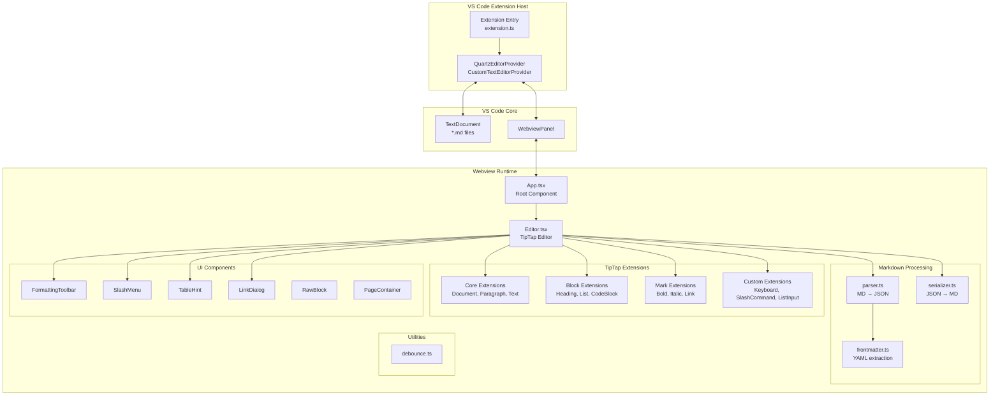
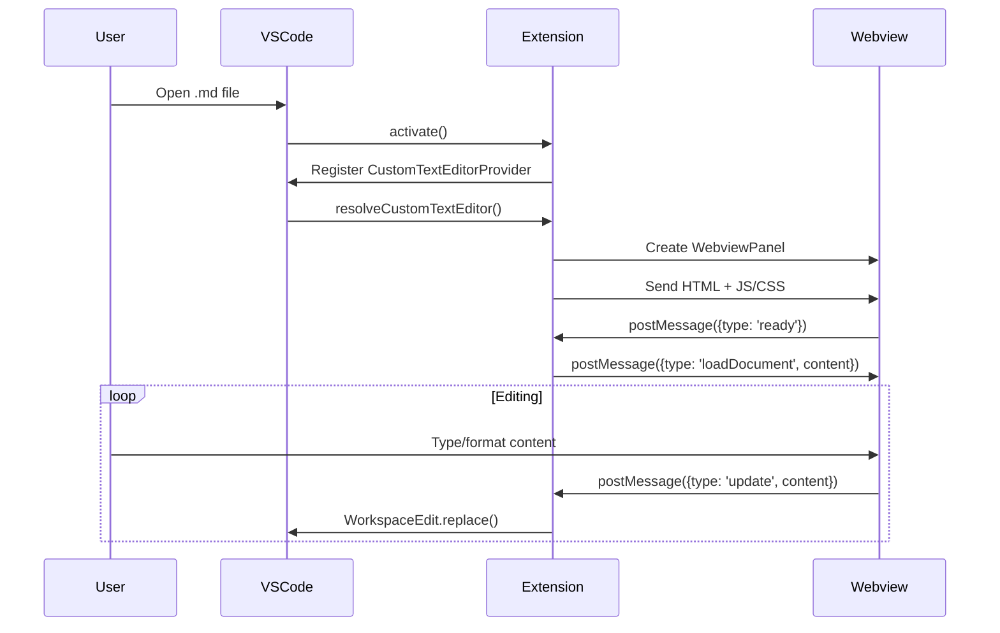
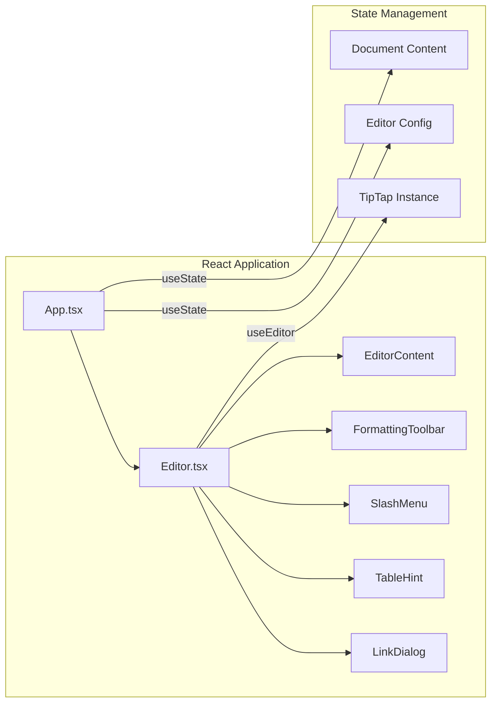
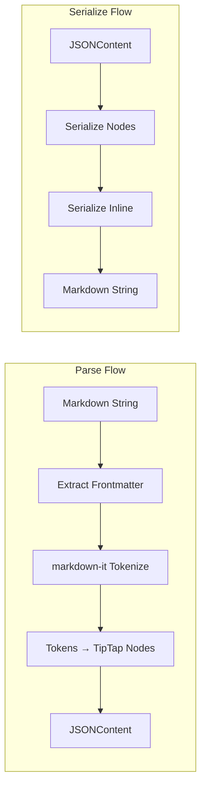
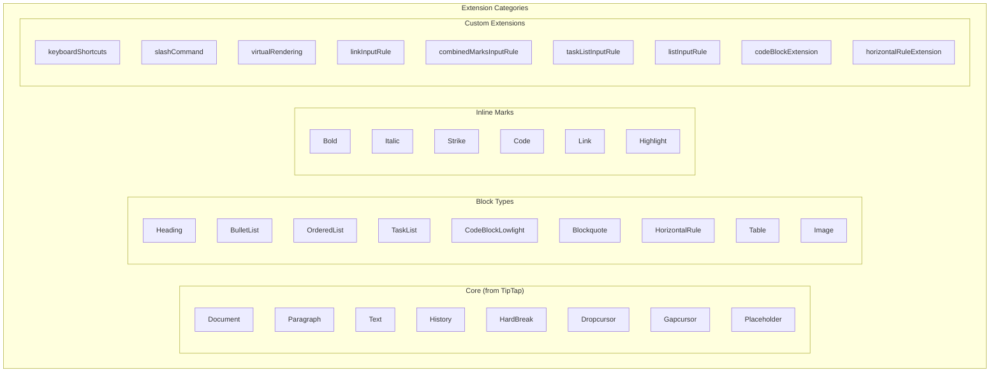
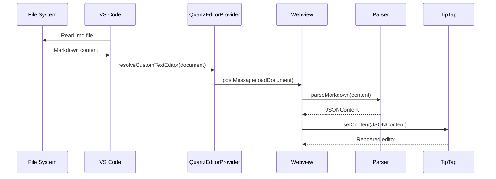
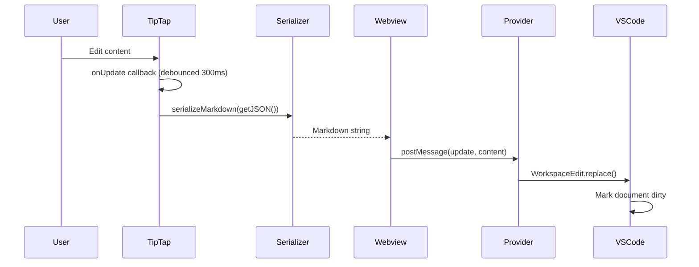
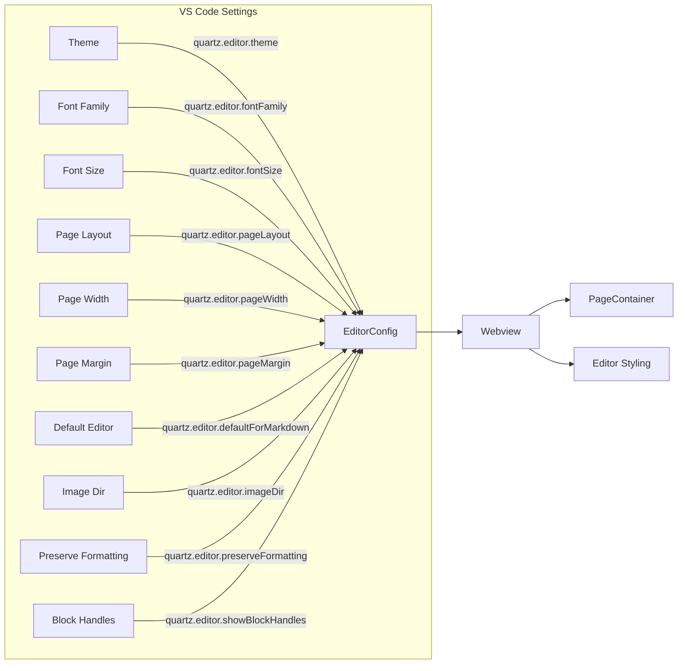
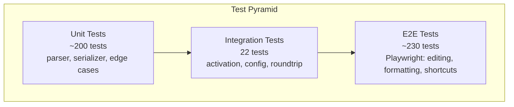

# Quartz System Architecture Design Document

**Author:** Claude (AI Assistant)
**Status:** COMPLETED
**Created:** 2026-02-15
**Last Updated:** 2026-02-20
**Reviewers:** Project maintainers

---

## 1. Problem Statement

Developers working with Markdown files in VS Code face a disconnect between writing content and seeing how it will appear. The default text editor requires mental parsing of Markdown syntax, while external preview panes create a fragmented editing experience with constant context-switching between source and preview.

Quartz solves this by providing a Notion-style WYSIWYG block editor directly within VS Code, allowing users to edit Markdown with rich formatting while maintaining perfect round-trip fidelity with the underlying `.md` files.

---

## 2. Goals and Non-Goals

### Goals
- **P0:** Provide WYSIWYG editing for CommonMark and GFM Markdown
- **P0:** Maintain 100% round-trip fidelity (parse → edit → serialize = original intent preserved)
- **P0:** Support all common block types: headings, lists, code blocks, tables, blockquotes, images
- **P1:** Offer keyboard shortcuts matching user expectations (Notion, Google Docs)
- **P1:** Support VS Code theming (light/dark/custom)
- **P2:** Enable slash commands for quick block insertion

### Non-Goals
- Real-time collaborative editing
- Export to formats other than Markdown (PDF, HTML, DOCX)
- Custom Markdown extensions beyond GFM
- Mobile or web standalone versions

---

## 3. System Architecture Overview



---

## 4. Component Details

### 4.1 VS Code Extension Layer



#### Key Files:
- **`src/extension.ts`** - Entry point, registers the editor provider and commands
- **`src/QuartzEditorProvider.ts`** - Implements `CustomTextEditorProvider`
  - Manages document ↔ webview communication
  - Handles configuration changes
  - Generates secure HTML with CSP headers

#### VS Code Commands:
| Command | Title |
|---------|-------|
| `quartz.openWithQuartz` | Open with Quartz Editor |
| `quartz.openWithTextEditor` | Open with Text Editor |
| `quartz.toggleEditor` | Toggle Editor Mode |

### 4.2 Webview Application Layer



#### Key Files:
- **`src/webview/App.tsx`** - Root component, manages VS Code message handling
- **`src/webview/Editor.tsx`** - TipTap editor configuration and rendering
- **`src/webview/index.tsx`** - Webview entry point
- **`src/webview/types.ts`** - TypeScript interfaces

### 4.3 Markdown Processing Pipeline



#### Parser (`src/markdown/parser.ts`)
Converts Markdown text to TipTap's JSONContent format:

```typescript
// Input
"# Hello **World**"

// Output (JSONContent)
{
  type: 'doc',
  content: [{
    type: 'heading',
    attrs: { level: 1 },
    content: [
      { type: 'text', text: 'Hello ' },
      { type: 'text', text: 'World', marks: [{ type: 'bold' }] }
    ]
  }]
}
```

**Key responsibilities:**
- Extract YAML frontmatter
- Parse CommonMark/GFM via markdown-it
- Handle task lists, tables, code blocks with language
- Preserve blockquote nesting

#### Serializer (`src/markdown/serializer.ts`)
Converts TipTap's JSONContent back to Markdown:

**Key responsibilities:**
- Maintain consistent spacing between blocks
- Serialize nested lists with proper indentation
- Handle table alignment markers
- Preserve code block language annotations

#### Frontmatter (`src/markdown/frontmatter.ts`)
Extracts and preserves YAML frontmatter from Markdown files.

### 4.4 TipTap Extension Architecture



#### Custom Extensions Detail:

| Extension | File | Purpose |
|-----------|------|---------|
| `keyboardShortcuts` | `keyboardShortcuts.ts` | Alt+Arrow block movement, table editing, formatting shortcuts |
| `slashCommandExtension` | `slashCommandExtension.ts` | Triggers slash menu on `/` in empty blocks |
| `virtualRenderingExtension` | `virtualRendering.ts` | Hides off-screen blocks for large documents (>1000 blocks) |
| `linkInputRuleExtension` | `linkInputRule.ts` | Converts `[text](url)` to links on typing |
| `combinedMarksInputRuleExtension` | `combinedMarksInputRule.ts` | Handles `***text***` for bold+italic, `**`, `*`, `` ` ``, `~~` |
| `taskListInputRuleExtension` | `taskListInputRule.ts` | Converts `- [ ]` to task list items |
| `listInputRuleExtension` | `listInputRule.ts` | Strips list markers typed inside existing list items |
| `codeBlockExtension` | `codeBlockExtension.ts` | Custom code block with lowlight, handles ``` closure |
| `horizontalRuleExtension` | `horizontalRuleExtension.ts` | Improved `---` input rules |

### 4.5 UI Components

| Component | File | Purpose |
|-----------|------|---------|
| `FormattingToolbar` | `FormattingToolbar.tsx` | Floating toolbar for text formatting |
| `SlashMenu` | `SlashMenu.tsx` | Slash command menu UI |
| `TableHint` | `TableHint.tsx` | Table keyboard shortcuts hint overlay |
| `LinkDialog` | `LinkDialog.tsx` | Link insertion/editing dialog |
| `RawBlock` | `RawBlock.tsx` | Raw markdown block display |
| `PageContainer` | `PageContainer.tsx` | Page layout container with configurable margins |

---

## 5. Data Flow

### 5.1 Document Loading



### 5.2 Content Editing



---

## 6. Configuration System



### Configuration Options:

| Setting | Type | Default | Description |
|---------|------|---------|-------------|
| `defaultForMarkdown` | `boolean` | `false` | Set Quartz as default editor for .md files |
| `theme` | `'auto' \| 'light' \| 'dark'` | `'auto'` | Editor color scheme |
| `fontFamily` | `string` | `'inherit'` | Font for editor content |
| `fontSize` | `number` | `16` | Base font size in pixels |
| `pageLayout` | `boolean` | `true` | Show page-like container |
| `pageWidth` | `number` | `816` | Page width in pixels |
| `pageMargin` | `number` | `72` | Page margin in pixels |
| `imageDir` | `string` | `'./assets'` | Relative path for pasted images |
| `preserveFormatting` | `boolean` | `true` | Maintain original markdown style on round-trip |
| `showBlockHandles` | `boolean` | `true` | Show drag handles on block hover |

---

## 7. Security Considerations

### Content Security Policy
```html
<meta http-equiv="Content-Security-Policy" content="
  default-src 'none';
  script-src 'nonce-${nonce}';
  style-src ${webview.cspSource} 'unsafe-inline';
  img-src ${webview.cspSource} data:;
  font-src ${webview.cspSource};
">
```

### Input Sanitization
- `linkInputRule` blocks `javascript:`, `vbscript:`, and non-image `data:` URLs
- Pasted HTML is sanitized to remove `<script>`, `<iframe>`, event handlers

---

## 8. Testing Strategy



### Test Infrastructure:

| Layer | Framework | Files | Description |
|-------|-----------|-------|-------------|
| Unit | Vitest | `test/*.test.ts`, `test/unit/*.test.ts` | Parser, serializer, debounce, edge cases |
| Integration | VS Code Test | `test/integration/*.test.ts` | Activation, configuration, file roundtrip |
| E2E | Playwright | `test/e2e/specs/*.spec.ts` | Full user interaction testing |
| QA | Manual | `test/qa/*.md` | Release checklists and block testing |

### Test File Breakdown:

**Unit Tests (~200 tests):**
- `parser.test.ts` - Core parser tests
- `serializer.test.ts` - Core serializer tests
- `features.test.ts` - Feature-level tests
- `roundtrip.test.ts` - Round-trip fidelity tests
- `performance.test.ts` - Performance benchmarks
- `debounce.test.ts` - Debounce utility tests
- `unit/parser-edge-cases.test.ts` - Parser edge cases
- `unit/serializer-edge-cases.test.ts` - Serializer edge cases
- `unit/roundtrip-all-blocks.test.ts` - Comprehensive block round-trip
- `unit/additional-edge-cases.test.ts` - Additional edge cases

**E2E Tests (~230 tests across 15 spec files):**
- `editing.spec.ts`, `inline-formatting.spec.ts` - Core editing
- `keyboard-shortcuts.spec.ts`, `block-movement.spec.ts` - Keyboard interactions
- `slash-commands.spec.ts` - Slash command menu
- `roundtrip.spec.ts`, `block-rendering.spec.ts` - Rendering fidelity
- `theme.spec.ts`, `page-layout.spec.ts`, `sidebar-alignment.spec.ts` - Visual config
- `editor-load.spec.ts`, `external-change.spec.ts` - Document lifecycle
- `comprehensive-editing-workflow.spec.ts` - End-to-end workflows
- `edge-cases.spec.ts`, `edge-cases-2.spec.ts` - Edge case coverage

**Test Fixtures:**
- `test/e2e/fixtures/` - Markdown fixtures for E2E tests
- `test/integration/fixtures/` - Markdown fixtures for integration tests
- `test/__mocks__/vscode.ts` - VS Code API mock

### NPM Scripts:
```bash
npm test              # Vitest unit tests
npm run test:integration  # VS Code integration tests
npm run test:e2e      # Playwright E2E tests
npm run test:all      # All test suites
```

---

## 9. Build System

### Build Tool: esbuild

Two separate bundles are produced:

| Bundle | Target | Entry | Output |
|--------|--------|-------|--------|
| Extension | Node.js | `src/extension.ts` | `dist/extension.js` |
| Webview | Browser | `src/webview/index.tsx` | `dist/webview/index.js` + `dist/webview/index.css` |

### NPM Scripts:
```bash
npm run build           # Build both bundles
npm run build:watch     # Watch mode
npm run build:webview   # Webview only
npm run package         # Create .vsix package
```

### CI/CD:
- `.github/workflows/ci.yml` - Continuous integration
- `.github/workflows/test.yml` - Test runner
- `.github/workflows/release.yml` - Marketplace publishing

---

## 10. File Structure

```
quartz/
├── src/
│   ├── extension.ts                    # VS Code extension entry
│   ├── QuartzEditorProvider.ts         # Custom editor provider
│   ├── markdown/
│   │   ├── parser.ts                   # MD → JSONContent
│   │   ├── serializer.ts              # JSONContent → MD
│   │   └── frontmatter.ts            # YAML extraction
│   └── webview/
│       ├── index.tsx                   # Webview entry
│       ├── App.tsx                     # Root component
│       ├── Editor.tsx                  # TipTap configuration
│       ├── types.ts                    # TypeScript interfaces
│       ├── components/
│       │   ├── FormattingToolbar.tsx
│       │   ├── SlashMenu.tsx
│       │   ├── TableHint.tsx
│       │   ├── LinkDialog.tsx
│       │   ├── PageContainer.tsx
│       │   └── RawBlock.tsx
│       ├── extensions/
│       │   ├── keyboardShortcuts.ts
│       │   ├── slashCommandExtension.ts
│       │   ├── virtualRendering.ts
│       │   ├── linkInputRule.ts
│       │   ├── combinedMarksInputRule.ts
│       │   ├── taskListInputRule.ts
│       │   ├── listInputRule.ts
│       │   ├── codeBlockExtension.ts
│       │   └── horizontalRuleExtension.ts
│       ├── commands/
│       │   └── slashCommands.ts
│       ├── styles/
│       │   ├── editor.css
│       │   └── rawBlock.css
│       └── utils/
│           └── debounce.ts
├── test/
│   ├── __mocks__/
│   │   └── vscode.ts
│   ├── *.test.ts                       # Unit tests (6 files)
│   ├── unit/                           # Additional unit tests (4 files)
│   ├── integration/                    # VS Code integration tests (5 files)
│   │   └── fixtures/                   # Integration test fixtures
│   ├── e2e/                            # Playwright E2E tests
│   │   ├── fixtures/                   # E2E test fixtures
│   │   ├── pages/
│   │   │   └── editor.page.ts          # Page object model
│   │   ├── specs/                      # E2E spec files (15 files)
│   │   ├── fixtures.ts
│   │   ├── global-setup.ts
│   │   ├── global-teardown.ts
│   │   ├── harness.html
│   │   └── server.ts
│   └── qa/                             # Manual QA checklists
├── dist/                               # Built output
├── images/                             # Extension icon and screenshots
├── .github/workflows/                  # CI/CD pipelines
├── esbuild.js                          # Build configuration
├── package.json                        # v0.1.1
├── tsconfig.json                       # Main TypeScript config
├── tsconfig.webview.json               # Webview TypeScript config
├── tsconfig.test-integration.json      # Integration test config
├── vitest.config.ts                    # Vitest configuration
├── playwright.config.ts                # Playwright configuration
└── .vscode-test.mjs                    # VS Code test runner config
```

---

## 11. Dependencies

### Runtime Dependencies
| Package | Version | Purpose |
|---------|---------|---------|
| `@tiptap/core` | ^2.11.0 | Rich text editor framework |
| `@tiptap/react` | ^2.11.0 | React bindings for TipTap |
| `@tiptap/extension-*` | ^2.11.0 | Editor extensions (26 packages) |
| `@tiptap/pm` | ^2.11.0 | ProseMirror internals |
| `@tiptap/suggestion` | ^2.11.0 | Suggestion/autocomplete framework |
| `markdown-it` | ^14.1.0 | Markdown parsing |
| `lowlight` | ^3.1.0 | Syntax highlighting engine |
| `highlight.js` | ^11.9.0 | Language grammars for syntax highlighting |
| `react` | ^18.2.0 | UI framework |
| `react-dom` | ^18.2.0 | React DOM renderer |

### Build Dependencies
| Package | Version | Purpose |
|---------|---------|---------|
| `esbuild` | ^0.24.0 | Fast bundling for extension and webview |
| `typescript` | ^5.3.3 | Type checking |
| `vitest` | ^2.1.0 | Unit testing |
| `@playwright/test` | ^1.58.1 | E2E testing |
| `@vscode/test-cli` | ^0.0.12 | VS Code integration test CLI |
| `@vscode/test-electron` | ^2.5.2 | VS Code test runtime |
| `@vscode/vsce` | ^3.7.1 | Extension packaging and publishing |

---

## 12. Open Questions

| Question | Owner | Status |
|----------|-------|--------|
| Should we support custom keyboard shortcut configuration? | Maintainer | Open |
| How to handle very large files (>10MB)? | Maintainer | Open |
| Should images be stored inline (base64) or externally? | Maintainer | Open |

---

## 13. Appendix

### A. Message Protocol

Messages between extension and webview:

```typescript
// Extension → Webview
{ type: 'loadDocument', content: string, fileName: string }
{ type: 'configUpdate', config: EditorConfig }
{ type: 'externalChange', content: string }

// Webview → Extension
{ type: 'ready' }
{ type: 'update', content: string }
```

### B. Supported Markdown Features

| Feature | Parse | Serialize | Edit |
|---------|-------|-----------|------|
| Headings (H1-H6) | Yes | Yes | Yes |
| Bold/Italic | Yes | Yes | Yes |
| Strikethrough | Yes | Yes | Yes |
| Inline Code | Yes | Yes | Yes |
| Links | Yes | Yes | Yes |
| Images | Yes | Yes | Yes |
| Bullet Lists | Yes | Yes | Yes |
| Numbered Lists | Yes | Yes | Yes |
| Task Lists | Yes | Yes | Yes |
| Code Blocks | Yes | Yes | Yes |
| Blockquotes | Yes | Yes | Yes |
| Tables | Yes | Yes | Yes |
| Horizontal Rules | Yes | Yes | Yes |
| YAML Frontmatter | Yes | Yes | View Only |
