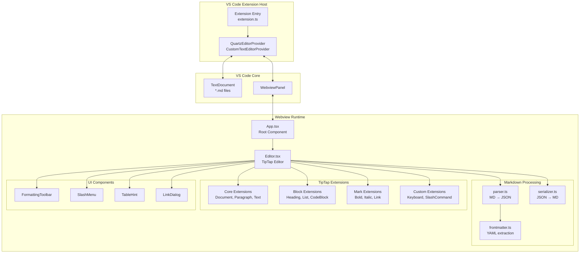
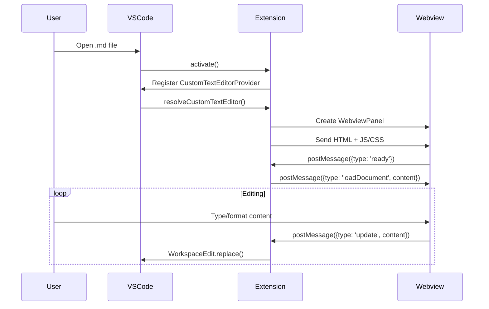
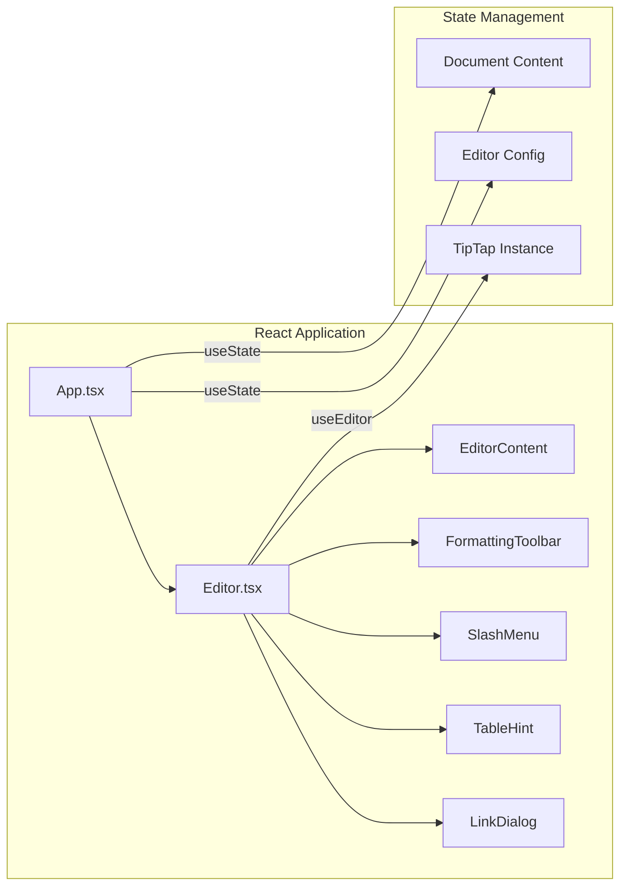
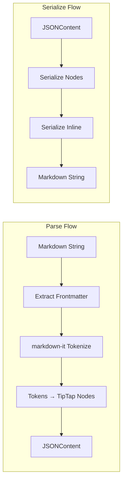
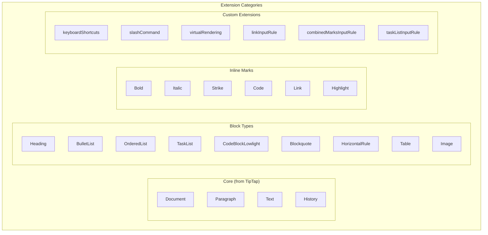
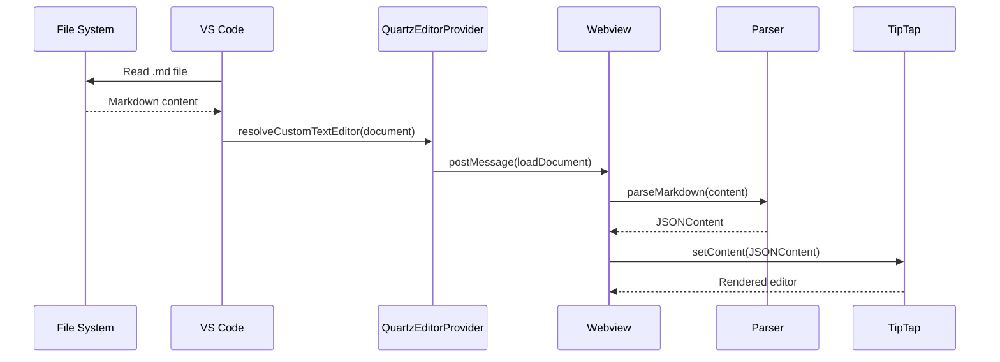
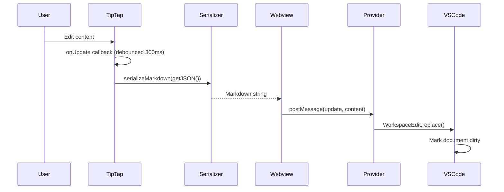
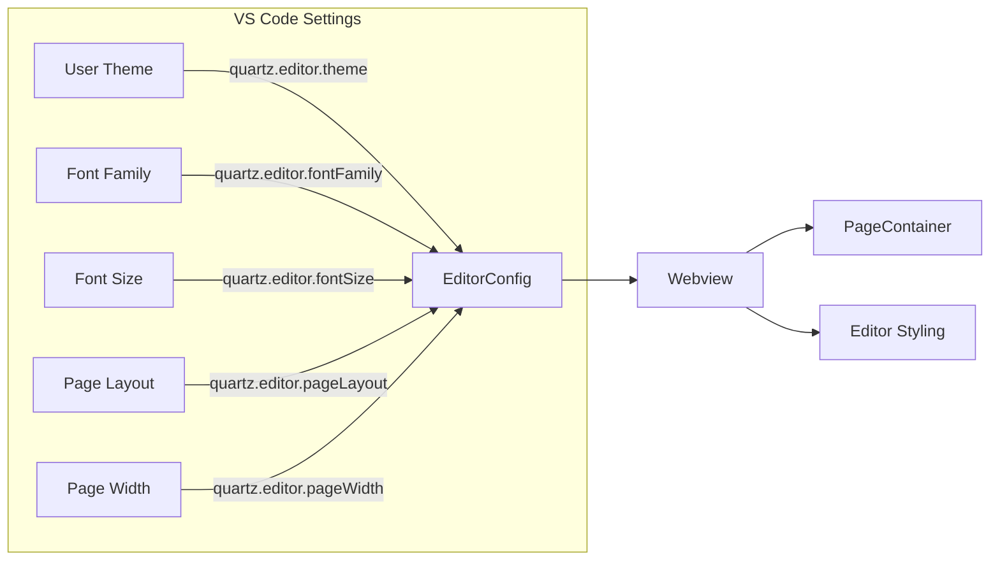
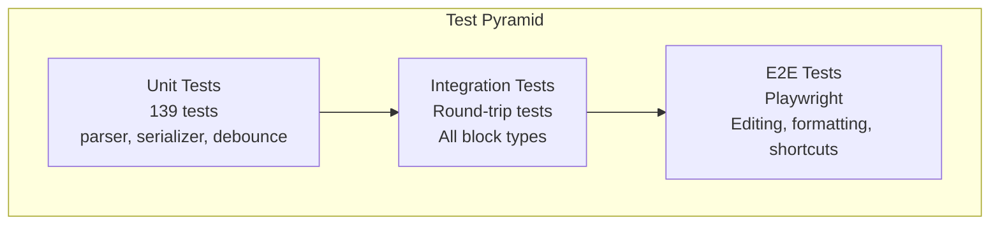

# Quartz System Architecture Design Document

**Author:** Claude (AI Assistant)
**Status:** DRAFT
**Created:** 2026-02-15
**Last Updated:** 2026-02-15
**Reviewers:** Project maintainers

---

## 1. Problem Statement

Developers working with Markdown files in VS Code face a disconnect between writing content and seeing how it will appear. The default text editor requires mental parsing of Markdown syntax, while external preview panes create a fragmented editing experience with constant context-switching between source and preview.

Quartz solves this by providing a Notion-style WYSIWYG block editor directly within VS Code, allowing users to edit Markdown with rich formatting while maintaining perfect round-trip fidelity with the underlying `.md` files.

---

## 2. Goals and Non-Goals

### Goals
- **P0:** Provide WYSIWYG editing for CommonMark and GFM Markdown
- **P0:** Maintain 100% round-trip fidelity (parse → edit → serialize = original intent preserved)
- **P0:** Support all common block types: headings, lists, code blocks, tables, blockquotes, images
- **P1:** Offer keyboard shortcuts matching user expectations (Notion, Google Docs)
- **P1:** Support VS Code theming (light/dark/custom)
- **P2:** Enable slash commands for quick block insertion

### Non-Goals
- Real-time collaborative editing
- Export to formats other than Markdown (PDF, HTML, DOCX)
- Custom Markdown extensions beyond GFM
- Mobile or web standalone versions

---

## 3. System Architecture Overview



---

## 4. Component Details

### 4.1 VS Code Extension Layer



#### Key Files:
- **`extension.ts`** - Entry point, registers the editor provider
- **`QuartzEditorProvider.ts`** - Implements `CustomTextEditorProvider`
  - Manages document ↔ webview communication
  - Handles configuration changes
  - Generates secure HTML with CSP headers

### 4.2 Webview Application Layer



#### Key Files:
- **`App.tsx`** - Root component, manages VS Code message handling
- **`Editor.tsx`** - TipTap editor configuration and rendering

### 4.3 Markdown Processing Pipeline



#### Parser (`parser.ts`)
Converts Markdown text to TipTap's JSONContent format:

```typescript
// Input
"# Hello **World**"

// Output (JSONContent)
{
  type: 'doc',
  content: [{
    type: 'heading',
    attrs: { level: 1 },
    content: [
      { type: 'text', text: 'Hello ' },
      { type: 'text', text: 'World', marks: [{ type: 'bold' }] }
    ]
  }]
}
```

**Key responsibilities:**
- Extract YAML frontmatter
- Parse CommonMark/GFM via markdown-it
- Handle task lists, tables, code blocks with language
- Preserve blockquote nesting

#### Serializer (`serializer.ts`)
Converts TipTap's JSONContent back to Markdown:

**Key responsibilities:**
- Maintain consistent spacing between blocks
- Serialize nested lists with proper indentation
- Handle table alignment markers
- Preserve code block language annotations

### 4.4 TipTap Extension Architecture



#### Custom Extensions Detail:

| Extension | Purpose |
|-----------|---------|
| `keyboardShortcuts` | Alt+Arrow block movement, table editing, formatting shortcuts |
| `slashCommandExtension` | Triggers slash menu on `/` in empty blocks |
| `virtualRenderingExtension` | Hides off-screen blocks for large documents (>1000 blocks) |
| `linkInputRuleExtension` | Converts `[text](url)` to links on typing |
| `combinedMarksInputRuleExtension` | Handles `***text***` for bold+italic |
| `taskListInputRuleExtension` | Converts `- [ ]` to task list items |
| `codeBlockExtension` | Custom exit behavior for code blocks |
| `horizontalRuleExtension` | Improved `---` input rules |

---

## 5. Data Flow

### 5.1 Document Loading



### 5.2 Content Editing



---

## 6. Configuration System



### Configuration Options:

| Setting | Type | Default | Description |
|---------|------|---------|-------------|
| `theme` | `'auto' \| 'light' \| 'dark'` | `'auto'` | Editor color scheme |
| `fontFamily` | `string` | `'inherit'` | Font for editor content |
| `fontSize` | `number` | `16` | Base font size in pixels |
| `pageLayout` | `boolean` | `true` | Show page-like container |
| `pageWidth` | `number` | `816` | Page width in pixels |
| `pageMargin` | `number` | `72` | Page margin in pixels |

---

## 7. Security Considerations

### Content Security Policy
```html
<meta http-equiv="Content-Security-Policy" content="
  default-src 'none';
  script-src 'nonce-${nonce}';
  style-src ${webview.cspSource} 'unsafe-inline';
  img-src ${webview.cspSource} data:;
  font-src ${webview.cspSource};
">
```

### Input Sanitization
- `linkInputRule` blocks `javascript:`, `vbscript:`, and non-image `data:` URLs
- Pasted HTML is sanitized to remove `<script>`, `<iframe>`, event handlers

---

## 8. Testing Strategy



### Test Coverage:
- **Unit Tests (Vitest):** Parser edge cases, serializer output, debounce behavior
- **Round-trip Tests:** Ensure `parse(serialize(parse(md))) === parse(md)`
- **E2E Tests (Playwright):** User interactions, keyboard shortcuts, slash commands

---

## 9. File Structure

```
quartz/
├── src/
│   ├── extension.ts              # VS Code extension entry
│   ├── QuartzEditorProvider.ts   # Custom editor provider
│   ├── markdown/
│   │   ├── parser.ts             # MD → JSONContent
│   │   ├── serializer.ts         # JSONContent → MD
│   │   └── frontmatter.ts        # YAML extraction
│   └── webview/
│       ├── index.tsx             # Webview entry
│       ├── App.tsx               # Root component
│       ├── Editor.tsx            # TipTap configuration
│       ├── types.ts              # TypeScript interfaces
│       ├── components/           # UI components
│       │   ├── FormattingToolbar.tsx
│       │   ├── SlashMenu.tsx
│       │   ├── TableHint.tsx
│       │   ├── LinkDialog.tsx
│       │   └── PageContainer.tsx
│       ├── extensions/           # Custom TipTap extensions
│       │   ├── keyboardShortcuts.ts
│       │   ├── slashCommandExtension.ts
│       │   ├── virtualRendering.ts
│       │   ├── linkInputRule.ts
│       │   ├── combinedMarksInputRule.ts
│       │   ├── taskListInputRule.ts
│       │   ├── codeBlockExtension.ts
│       │   └── horizontalRuleExtension.ts
│       ├── commands/
│       │   └── slashCommands.ts  # Slash command definitions
│       └── styles/
│           ├── editor.css
│           └── rawBlock.css
├── test/
│   ├── *.test.ts                 # Unit tests
│   └── e2e/                      # Playwright tests
├── dist/                         # Built output
└── package.json
```

---

## 10. Dependencies

### Runtime Dependencies
| Package | Version | Purpose |
|---------|---------|---------|
| `@tiptap/core` | ^2.x | Rich text editor framework |
| `@tiptap/react` | ^2.x | React bindings for TipTap |
| `@tiptap/extension-*` | ^2.x | Various editor extensions |
| `@tiptap/pm/*` | ^2.x | ProseMirror internals |
| `markdown-it` | ^14.x | Markdown parsing |
| `lowlight` | ^3.x | Syntax highlighting |
| `react` | ^18.x | UI framework |

### Build Dependencies
| Package | Purpose |
|---------|---------|
| `esbuild` | Fast bundling for extension and webview |
| `typescript` | Type checking |
| `vitest` | Unit testing |
| `playwright` | E2E testing |

---

## 11. Open Questions

| Question | Owner | Status |
|----------|-------|--------|
| Should we support custom keyboard shortcut configuration? | Maintainer | Open |
| How to handle very large files (>10MB)? | Maintainer | Open |
| Should images be stored inline (base64) or externally? | Maintainer | Open |

---

## 12. Appendix

### A. Message Protocol

Messages between extension and webview:

```typescript
// Extension → Webview
{ type: 'loadDocument', content: string, fileName: string }
{ type: 'configUpdate', config: EditorConfig }
{ type: 'externalChange', content: string }

// Webview → Extension
{ type: 'ready' }
{ type: 'update', content: string }
```

### B. Supported Markdown Features

| Feature | Parse | Serialize | Edit |
|---------|-------|-----------|------|
| Headings (H1-H6) | Yes | Yes | Yes |
| Bold/Italic | Yes | Yes | Yes |
| Strikethrough | Yes | Yes | Yes |
| Inline Code | Yes | Yes | Yes |
| Links | Yes | Yes | Yes |
| Images | Yes | Yes | Yes |
| Bullet Lists | Yes | Yes | Yes |
| Numbered Lists | Yes | Yes | Yes |
| Task Lists | Yes | Yes | Yes |
| Code Blocks | Yes | Yes | Yes |
| Blockquotes | Yes | Yes | Yes |
| Tables | Yes | Yes | Yes |
| Horizontal Rules | Yes | Yes | Yes |
| YAML Frontmatter | Yes | Yes | View Only |
