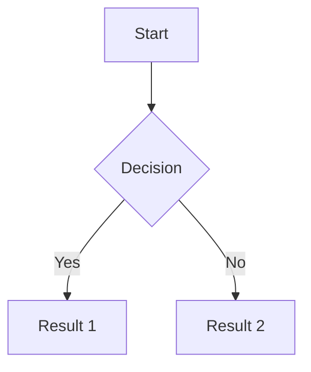
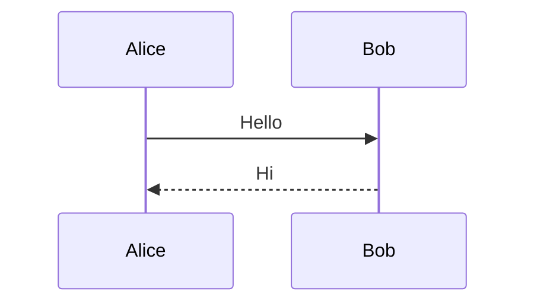

# Mermaid Test

## Flowchart


```mermaid
graph TD
    A[Start] --> B{Decision}
    B -->|Yes| C[Result 1]
    B -->|No| D[Result 2]
```

## Sequence


```mermaid
sequenceDiagram
    Alice->>Bob: Hello
    Bob-->>Alice: Hi
```

## Regular Code

```typescript
const x = 1;
```
