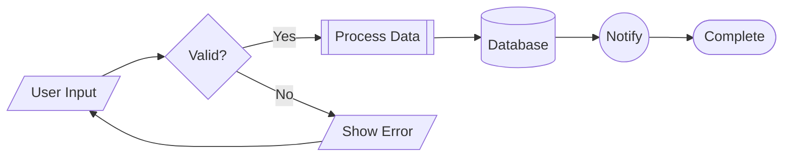
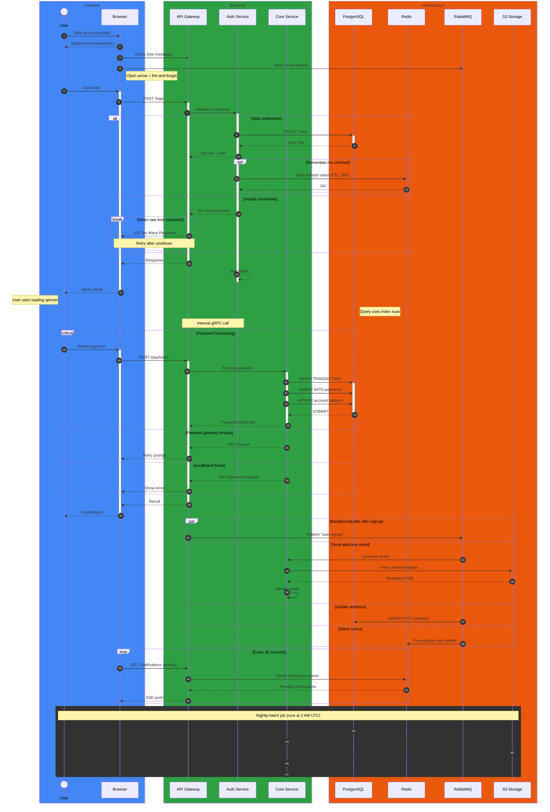

# Mermaid Feature Coverage Test

## Flowchart — Feature Showcase

```mermaid
graph TD
    %% Comment: This diagram demonstrates ~80% of flowchart features

    %% --- Node shapes ---
    A[Rectangle] --> B(Rounded)
    B --> C([Stadium])
    C --> D[[Subroutine]]
    D --> E[(Cylinder / DB)]
    E --> F((Circle))
    F --> G{Diamond / Decision}
    G --> H{{Hexagon}}
    H --> I[/Parallelogram/]
    I --> J[\Reverse Parallelogram\]
    J --> K[/Trapezoid\]
    K --> L[\Reverse Trapezoid/]
    L --> M>Asymmetric / Flag]
    M --> N(((Double Circle)))

    %% --- Link types ---
    N --> |Solid arrow| O[Step 1]
    O --- P[Step 2]
    P -.- Q[Step 3]
    Q -.-> R[Step 4]
    R ==> S[Step 5]
    S =="Thick labeled"==> T[Step 6]
    T --"Labeled solid"--> U[Step 7]
    U -."Labeled dotted".-> V[Step 8]
    V ~~~ W[Invisible link target]

    %% --- Link lengths (longer) ---
    W ----> X[Extra long link]
    X =====> Y[Extra thick long]

    %% --- Subgraphs ---
    subgraph External ["External Services"]
        direction LR
        API[REST API] --> Gateway[API Gateway]
        Gateway --> Lambda[Lambda Function]
    end

    subgraph Internal ["Internal Platform"]
        direction TB
        subgraph Data ["Data Layer"]
            DB1[(Primary DB)] --> DB2[(Read Replica)]
            DB2 --> Cache[(Redis)]
        end
        subgraph Compute ["Compute Layer"]
            Svc1[Auth Service] --> Svc2[User Service]
            Svc2 --> Svc3[Post Service]
        end
        Data --- Compute
    end

    Y --> External
    External --> Internal

    %% --- Styling ---
    classDef primary fill:#4f46e5,stroke:#3730a3,color:#fff,stroke-width:2px
    classDef success fill:#16a34a,stroke:#15803d,color:#fff
    classDef warning fill:#ea580c,stroke:#c2410c,color:#fff
    classDef danger fill:#dc2626,stroke:#b91c1c,color:#fff
    classDef muted fill:#6b7280,stroke:#4b5563,color:#fff,stroke-dasharray:5 5

    class A,B,C primary
    class O,P,Q success
    class G,H warning
    class M,N danger
    class W muted

    style API fill:#8b5cf6,stroke:#7c3aed,color:#fff
    style Gateway fill:#8b5cf6,stroke:#7c3aed,color:#fff
    style Lambda fill:#8b5cf6,stroke:#7c3aed,color:#fff

    %% --- Interactions between subgraphs ---
    Svc3 --> Cache
    Svc1 --> Gateway
```

## Flowchart — Left-to-Right Direction

```mermaid
graph LR
    Input[/User Input/] --> Validate{Valid?}
    Validate -->|Yes| Process[[Process Data]]
    Validate -->|No| Error[/Show Error/]
    Error --> Input
    Process --> Store[(Database)]
    Store --> Notify((Notify))
    Notify --> Done([Complete])
```

## Sequence Diagram — Feature Showcase

```mermaid
sequenceDiagram
    autonumber

    %% --- Participants: actor vs participant, aliases, box grouping ---
    box rgb(66, 135, 245) Frontend
        actor User
        participant Browser
    end

    box rgb(46, 160, 67) Backend
        participant API as API Gateway
        participant Auth as Auth Service
        participant Svc as Core Service
    end

    box rgb(234, 88, 12) Infrastructure
        participant DB as PostgreSQL
        participant Cache as Redis
        participant Queue as RabbitMQ
        participant S3 as S3 Storage
    end

    %% --- Arrow types ---
    User->>Browser: Solid arrow (request)
    Browser-->>User: Dotted arrow (response)
    Browser-xAPI: Cross (lost message)
    Browser-)Queue: Open arrow (async)
    Note right of Browser: Open arrow = fire-and-forget

    %% --- Activations ---
    User->>+Browser: Click login
    Browser->>+API: POST /login
    API->>+Auth: Validate credentials

    %% --- Alt / Else ---
    alt Valid credentials
        Auth->>+DB: SELECT user
        DB-->>-Auth: User row
        Auth-->>API: 200 OK + JWT

        %% --- Opt (optional) ---
        opt Remember me checked
            Auth->>Cache: Store refresh token (TTL: 30d)
            Cache-->>Auth: OK
        end

    else Invalid credentials
        Auth-->>API: 401 Unauthorized

        %% --- Break ---
        break When rate limit exceeded
            API-->>Browser: 429 Too Many Requests
            Note over Browser,API: Retry after cooldown
        end
    end

    API-->>-Browser: Response
    Auth-->>-Auth: Deactivate
    Browser-->>-User: Show result

    %% --- Notes: left, right, over multiple ---
    Note left of User: User sees loading spinner
    Note right of DB: Query uses index scan
    Note over API,Auth: Internal gRPC call

    %% --- Critical section ---
    critical Payment Processing
        User->>+Browser: Submit payment
        Browser->>+API: POST /payments
        API->>+Svc: Process payment
        Svc->>+DB: BEGIN TRANSACTION
        Svc->>DB: INSERT INTO payments
        Svc->>DB: UPDATE account balance
        DB-->>-Svc: COMMIT
        Svc-->>-API: Payment confirmed
    option Payment gateway timeout
        Svc-->>API: 504 Timeout
        API-->>Browser: Retry prompt
    option Insufficient funds
        Svc-->>API: 402 Payment Required
        API-->>Browser: Show error
    end
    API-->>-Browser: Result
    Browser-->>-User: Confirmation

    %% --- Parallel execution ---
    par Background jobs after signup
        API->>Queue: Publish "user.signup"
    and Send welcome email
        Queue->>Svc: Consume event
        Svc->>S3: Fetch email template
        S3-->>Svc: Template HTML
        Svc->>Svc: Render email
    and Update analytics
        Queue->>DB: INSERT INTO analytics
    and Warm cache
        Queue->>Cache: Pre-populate user profile
    end

    %% --- Loop ---
    loop Every 30 seconds
        Browser->>API: GET /notifications (polling)
        API->>Cache: Check notification queue
        Cache-->>API: Pending notifications
        API-->>Browser: SSE push
    end

    %% --- Rect (background highlight) ---
    rect rgb(50, 50, 50)
        Note over User,S3: Nightly batch job (runs at 2 AM UTC)
        DB->>Svc: Fetch stale records
        Svc->>S3: Archive to cold storage
        S3-->>Svc: Archived
        Svc->>DB: UPDATE status = 'archived'
        Svc->>Cache: Evict stale keys
    end
```
