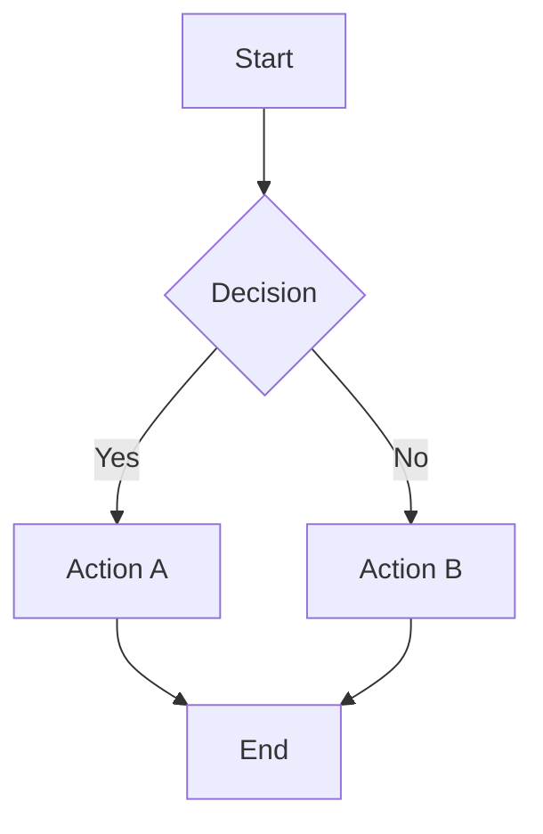
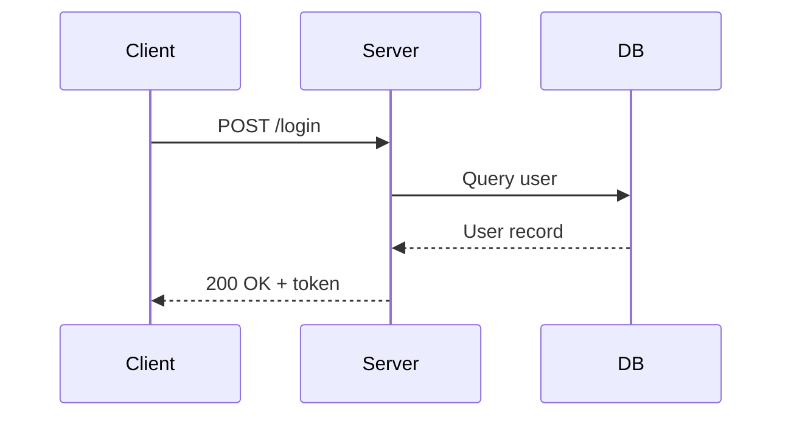
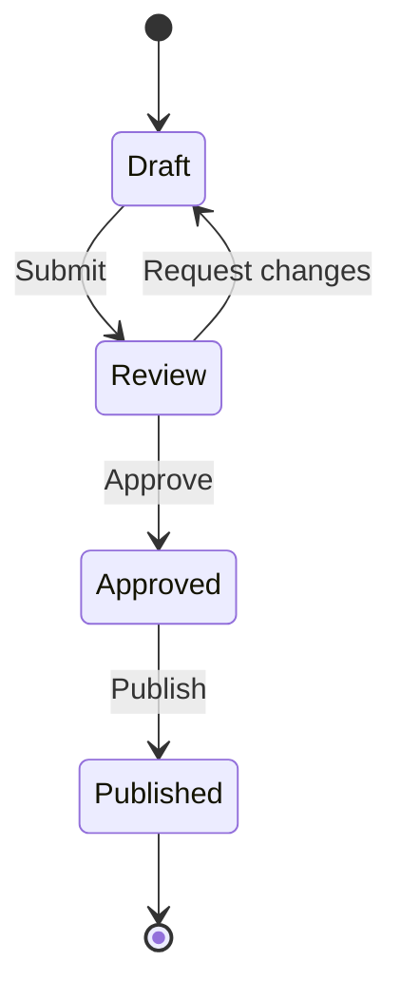
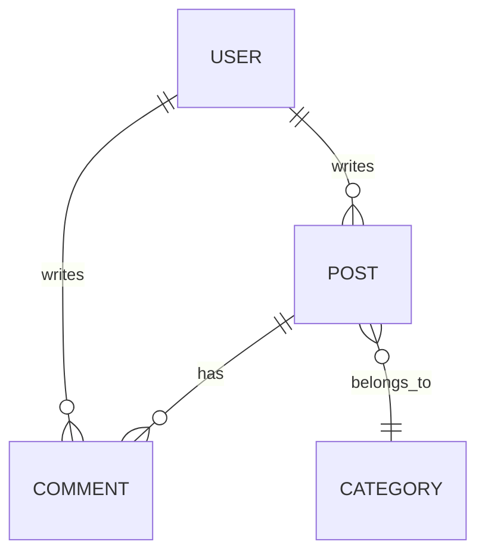
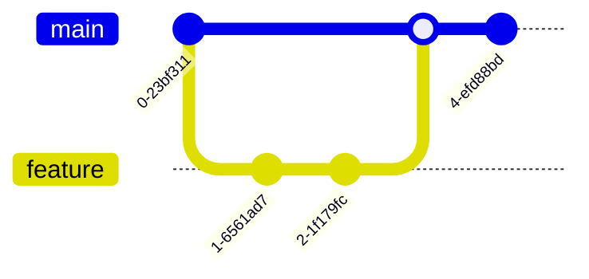

# Mermaid Diagram Test

Five simple-to-medium complexity diagrams that render within the 400px max-height.

## Flowchart

## Sequence Diagram

## State Diagram

## Entity Relationship Diagram

## Git Graph

