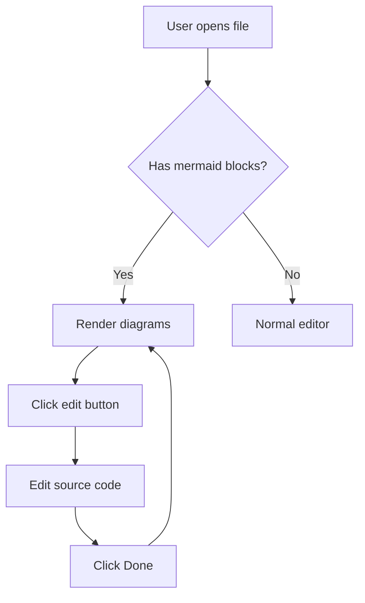
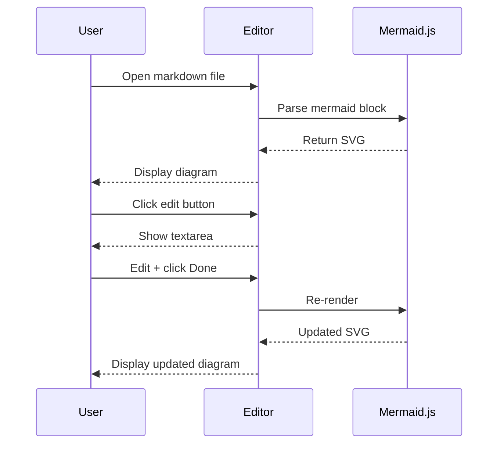

# Mermaid Diagram Test

Some text before diagrams.

## Flowchart



## Sequence Diagram



## Regular Code Block (should render normally)

```typescript
function hello() {
  console.log("This should be a normal code block");
}
```

## Invalid Mermaid (should show error)

```mermaid
this is not valid mermaid syntax
    --> broken
```

## Empty Mermaid Block

```mermaid
```

## Mixed Content After Diagrams

Regular paragraph after diagrams. Make sure everything below renders fine.

- List item 1
- List item 2
- List item 3

> A blockquote for good measure.
